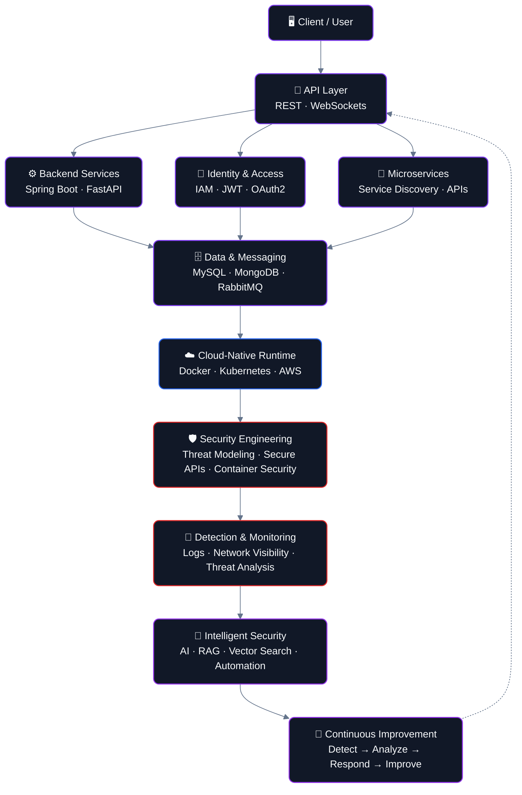
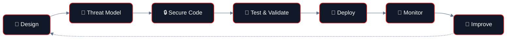
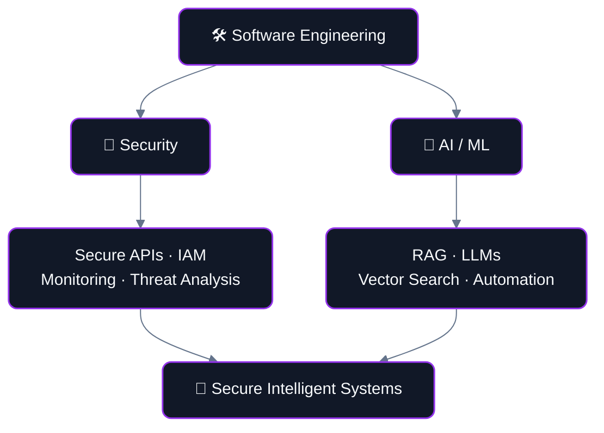

<!-- ========================================================= -->
<!--                    PROFILE HEADER                         -->
<!-- ========================================================= -->

    
# BOYINA NAGA SAI CHANDAN

### Aspiring Software Engineer · Backend Engineering · Security Engineering

**Designing secure, scalable and intelligent software systems.**

---

## About Me

Computer Science Engineering student focused on backend and distributed systems development using Java, Python, and TypeScript. Hands-on experience building RESTful microservices, real-time systems, containerized applications, Kubernetes-based workloads, and AI-powered platforms. Strong foundation in data structures, algorithms, system design, and software engineering, with a focus on writing reliable, maintainable production-oriented code.

<table>
<tr>
<td width="50%" valign="top">

#### 🎯 Current Focus
- Backend Engineering
- Distributed Systems
- Cloud-Native Architecture
- Cybersecurity
- Applied AI / RAG
- System Design

</td>
<td width="50%" valign="top">

#### 🚀 Open To
- Software Engineer
- Backend Engineer
- Security Engineer
- Cloud / DevOps Engineer

</td>
</tr>
</table>

---

## 🧭 Engineering Focus

<table>
<tr>
<td align="center" width="25%">

**🧩 Backend**  
Java 
Spring Boot 
REST APIs 
Microservices 
Distributed Systems

</td>
<td align="center" width="25%">

**☁️ Cloud**  
AWS 
Docker 
Kubernetes 
CI/CD 
Cloud-Native Systems

</td>
<td align="center" width="25%">

**🔐 Security**  
Authentication 
Authorization 
JWT / OAuth2 
IAM 
Secure APIs 
Network Security 
Threat Analysis

</td>
<td align="center" width="25%">

**🤖 AI**  
AI / ML 
RAG 
LangChain 
FAISS 
Vector Search

</td>
</tr>
</table>

---

## 🛠️ Technology Stack

**💻 Languages**

**⚙️ Backend & Frameworks**

**🗄️ Databases**

**☁️ Cloud & DevOps**

**🤖 AI / Intelligent Systems**

 

**🔐 Security**

━━━━━━━━━━━━━━━━━━━━━━━━━━━━━━━━━━━━━━━━━━━━━━━━━━━━━━━━━

## 🚀 What I've Built

<table>
<tr>
<td width="100%">

### 🛡️ AEGIS-X — AI-Driven Cyber Resilience Platform

Real-time threat monitoring platform with graph-based attack-path analysis and a **RAG pipeline** for context-aware threat investigation.

**[→ github.com/chandanboyina/AEGIS-X](https://github.com/chandanboyina/AEGIS-X)**

</td>
</tr>
<tr>
<td width="100%">

### ☁️ Cloud-Native Task Orchestration Platform

Distributed task engine that dynamically provisions **isolated Kubernetes pods** per job, with a live monitoring dashboard and automated deploy pipelines.

**[→ github.com/chandanboyina/Cloud-Native-Task-Orchestration-Platform](https://github.com/chandanboyina/Cloud-Native-Task-Orchestration-Platform)**

</td>
</tr>
<tr>
<td width="100%">

### 💇 Salon Appointment Booking Platform

Microservices booking system with centralized IAM (Keycloak), event-driven messaging (RabbitMQ), and real-time slot locking over WebSockets.

**[→ github.com/chandanboyina/Salon-appointment-booking](https://github.com/chandanboyina/Salon-appointment-booking)**

</td>
</tr>
<tr>
<td width="100%">

### 🤖 AI SaaS Chatbot

An AI-powered SaaS chatbot application built using the MERN stack and TypeScript, with secure authentication, role-based access control, OpenAI API integration, and a responsive React frontend.

**[→ github.com/chandanboyina/Ai-Saas-Chatbot](https://github.com/chandanboyina/Ai-Saas-Chatbot)**

</td>
</tr>
<tr>
<td width="100%">

### ⚙️ Flam Backend

A lightweight distributed CLI-driven job queue system built with Python, featuring asynchronous job execution, persistent storage, multiple worker management, retry and backoff mechanisms.

**[→ github.com/chandanboyina/Flam-Backend](https://github.com/chandanboyina/Flam-Backend)**

</td>
</tr>
</table>

 

━━━━━━━━━━━━━━━━━━━━━━━━━━━━━━━━━━━━━━━━━━━━━━━━━━━━━━━━━━━━━━━━━━━━

## 🏗️ How I Think About Systems

---

## 🔐 Security Engineering Mindset

I approach security as part of the software lifecycle rather than something added after development.

**Areas of Interest:** Application Security · API Security · Authentication & Authorization · IAM · JWT / OAuth2 · Network Security · Cloud Security · Container Security

---

## ☁️ Cloud-Native Engineering

---

## 🤖 AI × Software Engineering × Security

One of my major areas of interest is combining traditional software engineering with AI and cybersecurity.

---

## 🧠 Core Computer Science

<table>
<tr>
<td width="50%">

**Computer Science**
- Data Structures & Algorithms
- Object-Oriented Programming
- Operating Systems
- Computer Networks
- Database Systems
- Distributed Systems
- System Design
- Software Engineering

</td>
<td width="50%">

**Engineering Concepts**
- REST API Design
- Microservices
- Authentication
- Authorization
- Event-Driven Architecture
- Service Discovery
- Containerization
- CI/CD

</td>
</tr>
</table>

## 🏆 Certifications

| Certification | Area |
|---|---|
|  AWS Certified Cloud Practitioner | Cloud |
|  Fundamentals of Java Programming | Java |
|  The Joy of Computing Using Python | Python |
|  Cloud Computing | Cloud |
|  Fundamentals of Cryptography | Security |
|  Frontend for Java Full Stack Development | Development |
|  MongoDB | Database |

---

## 📈 Engineering Journey

---

## 🎯 Career Direction

I'm interested in entry-level engineering opportunities where I can work on real products, solve engineering problems and grow through production-level development.

**Primary:** Software Engineer · Backend Engineer
**Secondary / Specialized:** Security Engineer · Cloud / DevOps Engineer

**Problems I Want to Work On:** Scalable Systems · Distributed Systems · Backend Architecture · Cloud Platforms · Secure Software · AI-Powered Applications · Cybersecurity

---

## 💡 Engineering Principles

<table>
<tr>
<td align="center" width="20%">🔐 <b>SECURITY</b> Secure by design</td>
<td align="center" width="20%">📈 <b>SCALE</b> Design for growth</td>
<td align="center" width="20%">🧩 <b>MODULAR</b> Maintainable systems</td>
<td align="center" width="20%">⚡ <b>AUTOMATE</b> Reduce manual work</td>
<td align="center" width="20%">📊 <b>OBSERVE</b> Measure the system</td>
</tr>
</table>

---

## 📊 GitHub Stats

 

---

## 📫 Connect

Interested in software engineering, backend systems, cloud platforms or security?

**Open to building · learning · collaborating · Growing**

###  LEARN · CONTRIBUTE · GROW 

